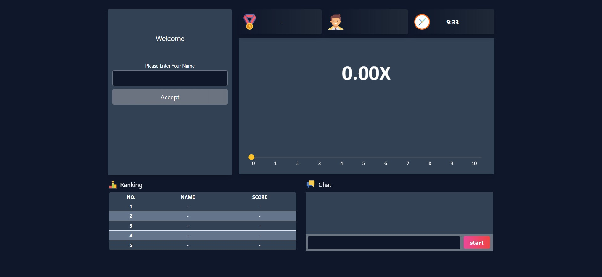
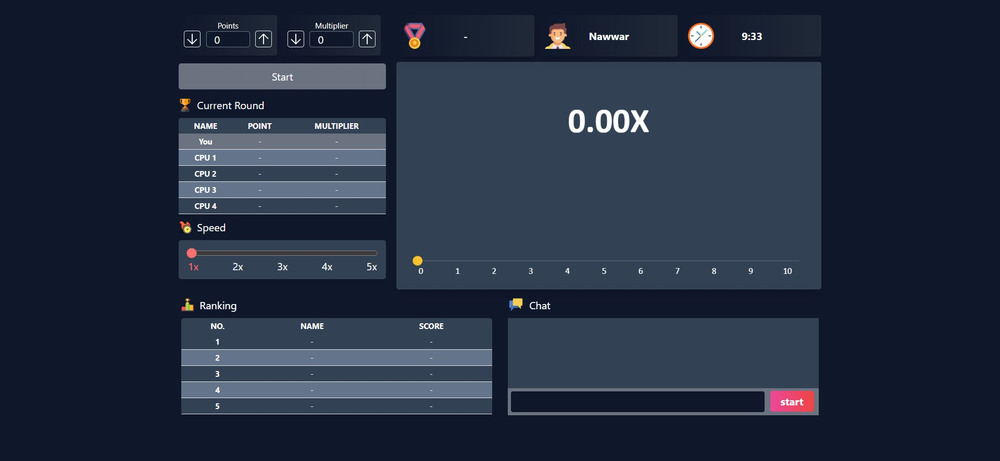

# NEST NEXT MONGO Websocket Full-Stack Test

## Overview

This is a guessing game based on random numbers and will progress through a series of rounds. The goal of this game is to observe the rising Multiplier value, predict at which point it will freeze, and place points based on the prediction

| | |
| ----------------------------------- | ----------------------------------- |
| | |


## Stack

- Backend
  - Typescript
  - NestJS
  - WebSocket
  - MongoDB
- Frontend
  - TypeScript
  - ReactJS/NextJS
  - WebSocket

## How to run the code

### Clone this repor

1- Clone the Repository
and then

```bash
cd nest-next-mongo
```

2- Installation

```bash
npm install
```

3- Dependencies

Change the env file (.env.dev and .env.prod)

4- Start locally

```bash
npm run start:dev
```

5- Open the url in your browser

```bash
> Application is running on: http://localhost:3000/
```
